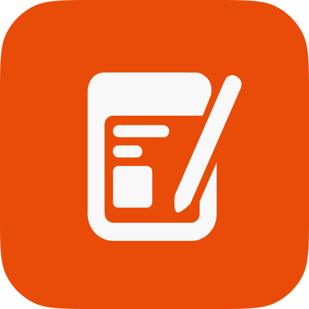

 

  
  <h3 align="center">Paperite on Electron</h3>
  

    Paperite is just another note-taking app
     
     
    <a href="https://github.com/othneildrew/Best-README-Template">About Paperite</a>
<!--     ·
    <a href="https://github.com/othneildrew/Best-README-Template/issues/new?labels=bug&template=bug-report---.md">Report Bug</a>
    ·
    <a href="https://github.com/othneildrew/Best-README-Template/issues/new?labels=enhancement&template=feature-request---.md">Request Feature</a> -->
    ·
    alpha-v0.1
  

   

## About Paperite

Paperite is just another note-taking app. Built with [Vue.js](https://vuejs.org/) and [Electron](https://www.electronjs.org) to support cross-platform like Windows, macOS, and Linux.
